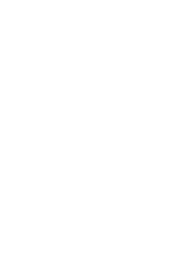

# Fancy clocks

Trying to display the time in many diffrent numerical systems, inspired by
[this](https://www.reddit.com/r/Damnthatsinteresting/comments/ybf6k0/damn/)
reddit post.

# Examples

The cistercian clock at the time 13:31

The roman clock at the time 14:44

The braille clock at the time 15:28

